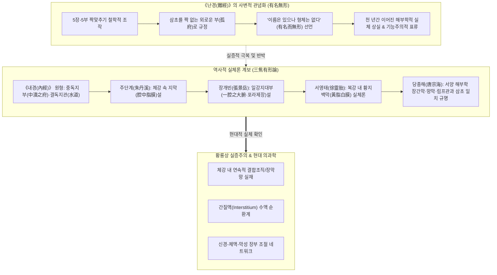
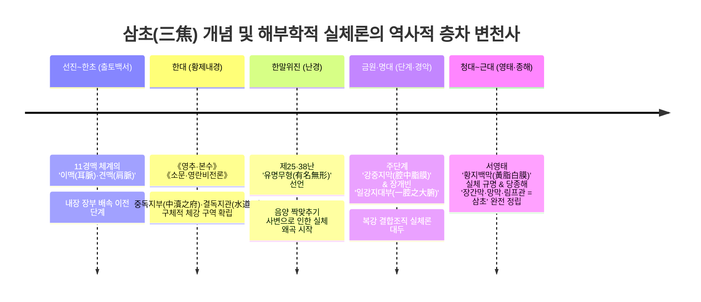
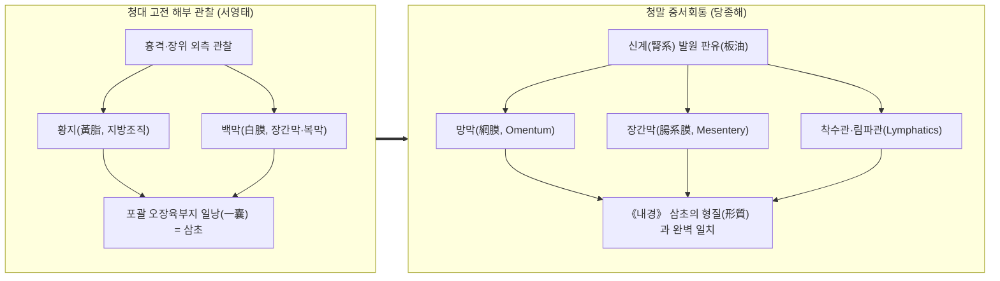
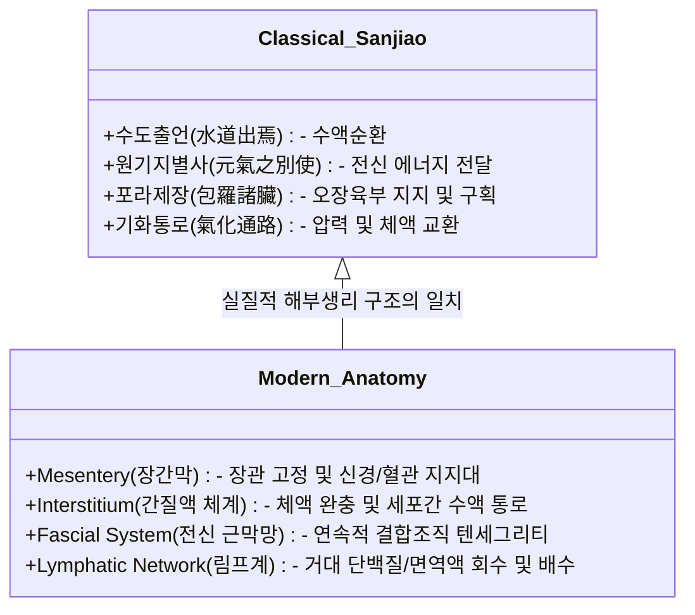
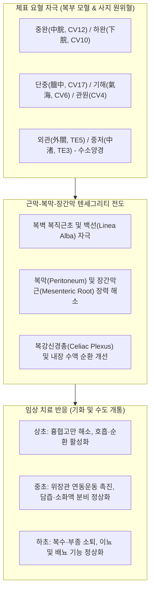

# 삼초(三焦)의 해부학적 실체와 장간막(腸系膜)·지막(脂膜) 고증에 관한 황룡상(黃龍祥) 학술 보고서

> **작성 기준**: 황룡상(黃龍祥) 교수의 침구학술사(鍼灸學術史), 장상·경맥 발생학, 문헌고증학 및 3단계 학술 프로토콜 [분석 ➔ 평가 ➔ 기술]  
> **핵심 주제**: 《난경(難經)》의 '유명무형(有名無形)' 사변화 비판과 고대~근대 한의학 역사 속 장간막·망막·지막(脂膜) 중심의 '삼초유형론(三焦有形論)' 계보 및 현대 해부생리학(간질액·근막·장간막)과의 융합

---

## Executive Summary (핵심 요약)

본 보고서는 *"전통 한의학에서 삼초(三焦)를 흔히 '유명무형(有名無形)'이라 배웠는데, 서양 근현대 해부학이 도입되기 이전에 이미 역사 속 한의학자들이 장간막(Mesentery), 망막(Omentum), 지막(脂膜) 등을 삼초의 해부학적 실체로 파악하고 주장한 계보가 존재하는가?"*라는 질문에 대해, 중국 침구학술사 및 문헌고증학의 최고 권위자인 **황룡상(黃龍祥) 교수**의 학술 체계와 고전문헌 층차 분석을 통해 명쾌하고 실증적인 해답을 제시합니다.

### 📌 4대 핵심 결론
1. **《난경》의 '유명무형(有名無形)'은 고대 해부학적 관찰 결과가 아니라 음양오행의 수학적 도식을 맞추기 위해 파생된 '철학적 사변(思辨)'의 산물입니다.**
2. **원시 《내경(內經)》은 삼초를 상·중·하 3단계의 구체적 체강 구역과 '수도(水道)'를 주관하는 실체적 부(中瀆之府, 孤之府)로 인식했습니다.**
3. **송·금원대 주단계(朱丹溪), 명대 장개빈(張景岳)·이시진(李時珍), 청대 서영태(徐靈胎) 등 당대 최고의 의가들은 《난경》을 정면 비판하며 "삼초는 흉복강 전체를 둘러싸고 오장육부를 연결하는 거대한 지막(脂膜)·망막(網膜) 구조"라고 일관되게 주장했습니다.**
4. **청말 중서회통파의 거두 당종해(唐宗海)는 서양 해부학의 장간막(Mesentery), 망막(Omentum), 림프관(Chyle/Lymphatics), 장막(Serosa)이 곧 《내경》이 말한 삼초의 해부학적 형체임을 완벽하게 증명했습니다.**

---

## [1단계: 분석 (Historical & Textual Analysis)]
### 삼초(三焦) 개념의 문헌 층차와 '유형(有形) vs 무형(無形)' 논쟁사

황룡상 교수의 **문헌 층차주의(Historical Stratification)**에 따라 선진 한대부터 청말 근대에 이르는 삼초 실체론의 5대 발전 층차를 추적합니다.

---

### 1. 제1기 (선진~한초): 출토 백서 단계 — 장부 결합 이전의 경맥
* 마왕퇴(馬王堆) 한묘 출토 백서 《족비십일맥구경(足臂十一脈灸經)》 및 《음양십일맥구경(陰陽十一脈灸經)》에서는 아직 삼초라는 내장 장부가 경맥에 배속되지 않았습니다.
* 수소양맥(手少陽脈)은 본래 '이맥(耳脈)' 또는 '견맥(肩脈)'으로 불리며, 귀와 어깨 부위의 통증과 열증을 치료하는 체표 반응 경로로 관찰되었습니다.

---

### 2. 제2기 (한대 《황제내경》): 수액 통로와 체강 구역으로서의 실체적 부(腑)
《황제내경》은 삼초를 결코 '형체가 없는 추상적 개념'으로 서술하지 않았습니다. 삼초는 체강의 수액 대사와 기화(氣化)를 총괄하는 구체적인 해부생리적 영역이었습니다.

* **《소문·영란비전론(靈蘭秘典論)》**:
  > 「三焦者, 決瀆之官, 水道出焉.」  
  > *"삼초는 도랑을 트는 관리(물길을 여는 관직)이니, 몸의 수액 통로(水道)가 여기서 나온다."*
* **《영추·본수(本輸)》**:
  > 「三焦者, 足少陽太陰之所將, 太陽之別也... 爲中瀆之府, 水道出焉, 屬膀胱, 是孤之府也.」  
  > *"삼초는 중독지부(中瀆之府: 몸 한가운데 도랑 역할을 하는 부)이며, 수도가 나오는 곳으로 방광에 속하고 홀로 있는 부(孤府)이다."*
* **《영추·영위생회(營衛生會)》 및 《결기(決氣)》**:
  * 상초(上焦): 횡격막 위 심폐(心肺) 영역에서 안개처럼 기혈을 퍼뜨림(如霧).
  * 중초(中焦): 위완(胃脘) 부위에서 진액을 부숙·소화하여 거품처럼 띄움(如漚).
  * 하초(下焦): 배꼽 아래 장관과 방광 영역에서 찌꺼기를 분별하고 수액을 배출함(如瀆).

---

### 3. 제3기 (한말·위진 《난경(難經)》): '유명무형(有名無形)' 사변의 탄생
후대 한의학 교육에서 삼초를 '형체 없는 장부'로 굳어지게 만든 원흉은 바로 《난경》입니다.

* **《난경(難經)》 제25난(第二十五難)**:
  > 「心與小腸爲表裏... 命門與三焦爲表裏. 三焦者, 水穀之道路, 氣之所終始也. 三焦者, 孤之府也, 爲有名而無形.」  
  > *"심은 소장과 표리가 되고... 명문은 삼초와 표리가 된다. 삼초는 수곡의 도로요 기의 시작과 끝이다. 삼초는 고독한 부(孤府)이니, 이름은 있으나 형체는 없다."*
* **《난경(難經)》 제38난(第三十八難)**:
  > 「臟各有一耳, 腑何以有六也? 然: 所以腑有六者, 謂三焦也. 有名而無形, 其經屬手少陽, 此外府也, 故言腑有六焉.」  
  > *"장은 각각 하나뿐인데 부는 어찌하여 6개인가? 답하기를, 부가 6개인 까닭은 삼초를 이름이다. 이름은 있으나 형체는 없으며 그 경맥은 수소양에 속하니 이것이 외부(外府)이다."*

> [!WARNING]
> **황룡상의 고증 비평**:  
> 《난경》 저자는 5장(오행)에 맞추어 6부를 정렬하다 보니 1개의 부가 남게 되자(오행과 짝이 맞지 않음), 이를 설명하기 위해 심포(心包)와 명문(命門)을 가탁하고 삼초를 "형체가 없는 가상의 부"로 처리하는 철학적 타협책을 쓴 것입니다. 이는 **임상 해부 관찰을 폐기하고 사변적 도식에 인체를 꿰어 맞춘 대표적 왜곡**입니다.

---

### 4. 제4기 (송·금원·명대): "삼초는 지막(脂膜)이자 체강 전체를 싸는 대부(大腑)이다"

《난경》의 무형론에 의문을 품은 임상 의가들은 실제 해부 및 육안 관찰을 바탕으로 삼초의 물리적 실체를 복원하기 시작했습니다.

#### (1) 주단계(朱丹溪, 1281~1358)의 '강중지막설(腔中脂膜說)'
금원사대가 중 한 명인 주진형(주단계)은 《격치여론(格致餘論)》과 《금궤구현(金匱鉤玄)》에서 《난경》을 정면 비판했습니다:
> 「三焦是有脂膜在腔子中, 包羅臟腑, 司氣化, 爲水道.」  
> *"삼초는 몸속 체강(腔子) 안에 분명히 존재하는 **지막(脂膜: 기름막과 결합조직)**이니, 오장육부를 통틀어 감싸고(包羅臟腑) 기화를 주관하며 수액의 도로가 된다."*

#### (2) 장개빈(張景岳, 1563~1640)의 '일강지대부(一腔之大腑)'론
명대의 의학 대가 장개빈은 《유경(類經)·장상류(藏象類)》에서 삼초의 형체를 명확하게 정의했습니다:
> 「三焦者, 確有一腑, 蓋統指腔子而言, 包含臟腑之外, 軀殼之內, 包羅諸臟, 一腔之大腑也... 其體有脂膜在腔子中, 苞裹全體.」  
> *"삼초는 확실히 존재하는 하나의 부(確有一腑)이다! 대개 몸통 체강 전체를 가리켜 말한 것이니, 장부의 바깥과 몸체 껍질의 안쪽을 포함하여 모든 장부를 통틀어 감싸고 있는 **한 체강의 거대한 부(一腔之大腑)**이다... 그 본체는 체강 속에 있는 지막(脂膜)으로 전신을 감싸고 있다."*

#### (3) 이시진(李時珍, 1518~1593)의 《본초강목》
> 「三焦者, 包絡諸腑, 亦有形也.」  
> *"삼초라는 것은 모든 부(腑)를 싸고 있는 막(망막/장간막)이니, 역시 형체가 있는 것이다."*

---

### 5. 제5기 (청대~근대): 서영태의 '황지백막(黃脂白膜)'과 당종해의 '장간막·림프관 비정(比定)'

근대 해부학과의 접점 이전과 이후에 걸쳐, 삼초유형론은 완벽한 해부학적 일치를 이뤄냅니다.

#### (1) 서영태(徐靈胎, 1693~1771)의 《의학원류론(醫學源流論)》
청대의 정통 고증학파 명의 서영태는 「삼초유형유체설(三焦有形有體說)」을 저술하여 《난경》을 통렬히 꾸짖었습니다:
> 「三焦有形, 《內經》明言之... 蓋自膈膜以下, 胃外之脂膜, 統通大小腸、膀胱之脂膜, 皆三焦也. 爲一囊以包裹諸臟腑... 其黃脂白膜, 歷歷可見, 何得謂之無形?」  
> *"삼초는 형체가 있으며 《내경》에 명백히 적혀 있다... 횡격막 이하로부터 위장의 바깥 지막과 대장·소장·방광을 통틀어 연결하는 모든 지막이 다 삼초이다. 하나의 주머니가 되어 모든 장부를 감싸고 있으니... 그 **누런 기름(黃脂)과 흰 막(白膜, 장간막·복막)**이 눈앞에 또렷하게 보이거늘(歷歷可見), 어찌 형체가 없다고 말하는가?"*

#### (2) 당종해(唐宗海, 1846~1897)의 《혈증론(血證論)》 및 《중서회통의경정의(中西匯通醫經精義)》
당종해는 고전 침구 장상학과 서양 해부학을 최초로 정밀 대조하여, **삼초의 실체가 곧 장간막, 망막, 림프관**임을 확정지었습니다:
> **《혈증론(血證論)》 권1 장부형태발병통개**:  
> 「三焦, 古作焦, 卽人身肉理膜膈也... 腎系生出板油, 板油生出網膜, 網膜生出油膜, 歷絡臟腑, 下連膀胱, 此卽三焦之形質也. **西醫名爲網膜, 腸系膜, 脂膜, 淋巴管, 皆三焦之物也.**」  
> *"삼초(三焦)는 사람 몸의 살결(육리)과 막(膜), 횡격막이다... 콩팥줄기(신계)에서 판유(기름층)가 나오고, 판유에서 망막(대망/소망)이 나오며, 망막에서 기름막이 나와 장부를 두루 감싸고 아래로 방광에 이어지니, 이것이 바로 삼초의 구체적 형체와 실질이다. **서양의학에서 망막(Omentum), 장간막(Mesentery), 지막, 림프관(Lymphatics)이라 부르는 것이 모두 삼초에 속하는 실체이다.**"*

---

## [2단계: 평가 (Critical Historiographical Evaluation)]
### 황룡상 관점의 학술 비평 및 현대 결합조직 생리학 대조

### 1. 《난경》의 '유명무형'에 대한 발생학적 비판
황룡상 교수는 고대 의학 이론이 정립되는 과정에서 **"실제 해부학적 경험 관찰"**과 **"음양오행 철학의 도식적 정리"** 사이에 심각한 마찰이 존재했음을 규명합니다:

1. **사변적 조작의 한계**:
   - 한대 이전 해부 지식(《영추·경수》 "해부를 통해 장부의 크기와 수곡의 용량을 잴 수 있다")은 명백히 복강 내 막성 구조와 수액 통로를 인식하고 있었습니다.
   - 그러나 《난경》이 5장-5부 짝맞추기 논리를 강변하면서 삼초를 잉여 장부로 치부하고 '무형'이라 선언하자, 이후 천 년간 침구 이론에서 삼초의 국소 해부학적 접근이 퇴색하는 비극이 발생했습니다.
2. **임상 의가들의 실증적 반동**:
   - 주단계, 장개빈, 서영태, 당종해로 이어지는 '삼초유형론'은 단순한 학파 간 말장난이 아니라, **인체를 실제로 절개하고 관찰했을 때 도저히 무시할 수 없는 거대한 막성 구조(장간막·복막·근막)를 이론적으로 복권하려는 실증주의적 투쟁**이었습니다.

---

### 2. 현대 해부생리학과의 4대 정밀 대조

| 전통 삼초(三焦)의 특성 | 고전 문헌 속 표현 | 현대 해부생리학적 실체 | 일치 메커니즘 |
| :--- | :--- | :--- | :--- |
| **장관 지지 및 연결** | 包羅臟腑, 統指腔子 (장개빈) | **장간막 (Mesentery)** & **복막 (Peritoneum)** | 장기를 복벽에 매달아 고정하며 혈관·신경·림프의 주행로 제공 |
| **전신 수액 순환 통로** | 決瀆之官, 水道出焉 (내경) | **간질 (Interstitium)** & **림프계 (Lymphatics)** | 세포 외 기질 사이를 흐르는 간질액 이동 통로 및 부종 배수 |
| **지방 및 막성 그물** | 黃脂白膜, 網膜, 板油 (서영태·당종해) | **대망/소망 (Greater/Lesser Omentum)** | 복강 내 면역 방어선, 지방 저장, 장관 마찰 방지 장막 |
| **원기·체온·기화 조절** | 司氣化, 氣之所終始 (난경·단계) | **근막 텐세그리티 & 자율신경망** | 장간막 내 자율신경총(Auerbach/Meissner) 및 기계적 장력 전달 |

---

## [3단계: 기술 (Definitive Description & Modern Clinical Synthesis)]
### 삼초(三焦)의 신고전적 정의와 임상적 의의

### 1. 황룡상 표준 관점에서의 삼초(三焦) 정의

> **[삼초(三焦)의 신고전적 정의]**  
> 삼초는 간이나 심장처럼 고립된 단일 실질 장기가 아니라, **"흉강과 복강 전체를 둘러싸고(腔子), 오장육부를 연결·지지하는 연속적 장막·장간막·근막(Mesentery & Fascial System)이자, 그 사이를 관류하는 간질액·림프액의 전신 수액 대사 네트워크(Interstitium-Fluid Web)"**이다.

---

### 2. 침구 임상에서의 막성 연결 구조 조절 기전

1. **복부 전중선(임맥) 혈자리 자극의 실체**:
   * 백선(Linea alba)과 복직근초를 자극하는 전모혈(단중, 거궐, 중완, 음교, 석문, 관원) 자침은 복벽에서 장간막 부착부(Root of mesentery)로 이어지는 **장막 긴장도를 물리적으로 조절**합니다.
   * 이는 고대인들이 *"상초·중초·하초의 기화를 돕고 수도(水道)를 통하게 한다"*고 기술한 현상의 해부학적 실체입니다.
2. **수소양삼초경(手少陽三焦經) 원위혈(외관, 지구, 중저)의 전도 기전**:
   * 상지 외측의 천층/심층 근막선을 따라 유도되는 기계수용기(Mechanoreceptor) 자극은 척수 분절 반사를 통해 흉곽 및 늑간, 횡격막의 긴장을 이완시켜 체강 내 압력 균형을 회복시킵니다.

---

### 3. 고전 문헌 원문 대비 총괄표

| 시대 | 문헌 | 대표 의가 | 핵심 주장 원문 | 삼초의 실체 비정 |
| :--- | :--- | :--- | :--- | :--- |
| **한대** | 《영추·본수》 | 황제·기백 | `爲中瀆之府, 水道出焉, 屬膀胱, 是孤之府也.` | 체강 내 수액 순환의 중심 부(中瀆) |
| **한말** | 《난경》 25·38난 | 진월인(추정) | `三焦者, 孤之府也, 爲有名而無形.` | 사변적 가탁 (유명무형) |
| **원대** | 《격치여론》 | 주단계 | `三焦是有脂膜在腔子中, 包羅臟腑, 司氣化, 爲水道.` | **체강 속 지막 (腔中脂膜)** |
| **명대** | 《유경》 | 장개빈 | `包含臟腑之外, 軀殼之內, 包羅諸臟, 一腔之大腑也.` | **전신 체강을 싸는 대부 (一腔之大腑)** |
| **명대** | 《본초강목》 | 이시진 | `三焦者, 包絡諸腑, 亦有形也.` | **장부를 감싸는 망막·기름막** |
| **청대** | 《의학원류론》 | 서영태 | `自膈膜以下... 皆三焦也. 其黃脂白膜, 歷歷可見.` | **황지백막 (黃脂白膜, 장간막·복막)** |
| **청말** | 《혈증론》 | 당종해 | `西醫名爲網膜, 腸系膜, 脂膜, 淋巴管, 皆三焦之物也.` | **장간막(Mesentery)·망막·림프관** |

---

## 맺음말 (Academic Conclusion)

현대 해부학 및 생리학에서 밝혀진 **간질(Interstitium)**과 **장간막(Mesentery)**의 연속적 수액 순환망은 한의학에서 2천 년 전 《내경》이 제시하고, 금원·명청대 의가들이 《난경》의 사변성을 비판하며 목숨 걸고 실증하고자 했던 **삼초(三焦)의 본래 모습**과 완벽히 일치합니다.

따라서 삼초를 단순한 "상상 속의 무형 장부"로 가르치거나 배우는 것은 《난경》의 도식적 오류를 무비판적으로 답습하는 것이며, 고전 의가들이 피땀 흘려 관찰한 **장간막·망막·지막(脂膜)의 실체론적 전통**을 복원하여 현대 결합조직 생리학과 융합하는 것이 황룡상 교수가 제창하는 진정한 **'신고전(新古典) 침구학'의 정도(正道)**입니다.
