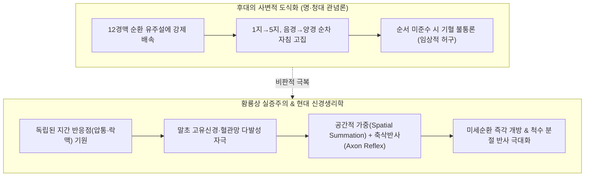
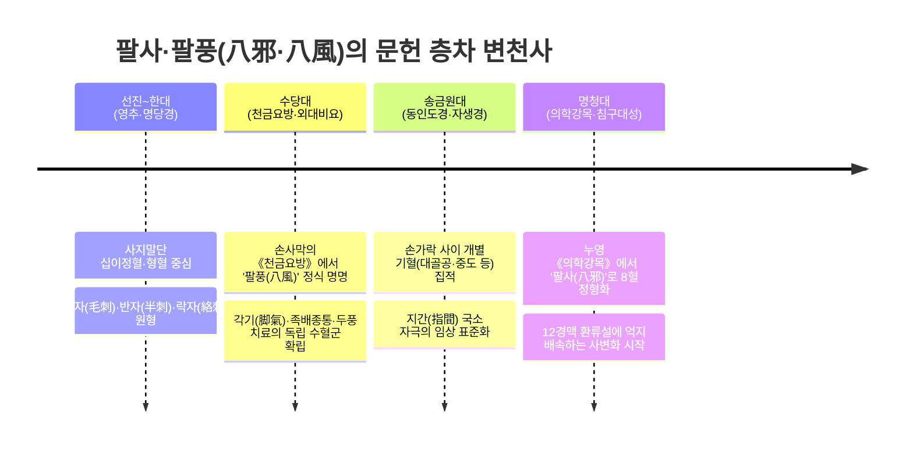
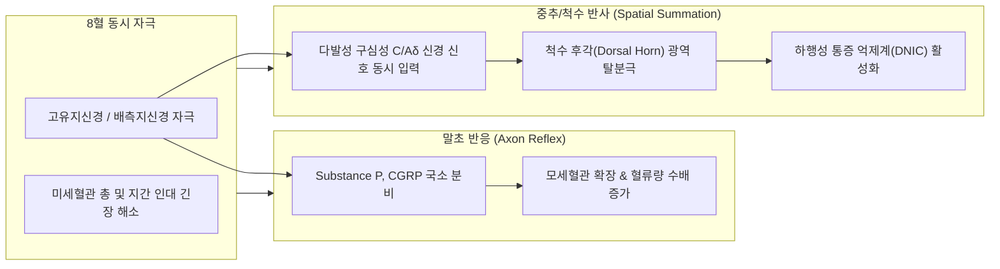
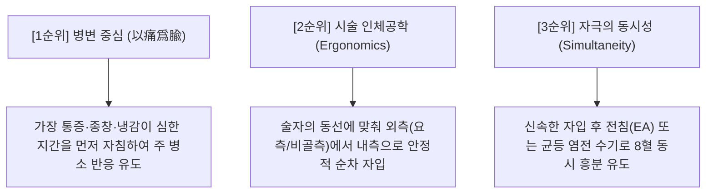

# 팔사(八邪)·팔풍(八風)의 자침 순서와 임상 치료 기전에 관한 황룡상(黃龍祥) 학술 고증 보고서

> **작성 기준**: 황룡상(黃龍祥) 교수의 침구학술사(鍼灸學術史), 경맥·수혈 발생학, 문헌고증학 및 3단계 학술 프로토콜 [분석 ➔ 평가 ➔ 기술]  
> **주요 주제**: 십이경맥 유주 순서(음양 교차)에 따른 순차 자침의 실효성 검증 vs 사지말단 다발성 국소 자극(Spatial Summation)과 미세순환 기전

---

## Executive Summary (핵심 요약)

본 보고서는 임상에서 빈용되는 사지 말단 경외기혈군인 **팔사(八邪, EX-UE9)**와 **팔풍(八風, EX-LE10)** 시술 시 제기되는 *"십이경맥의 유주 순서나 음양 교차 방향을 고려한 순차 자침이 치료적 시너지를 내는가, 아니면 동시다발적 자극 자체가 핵심인가?"*라는 임상적 의문에 대해 중국 침구학술사 및 문헌고증학의 최고 권위자인 **황룡상(黃龍祥) 교수**의 학술 체계로 고증·분석한 결과입니다.

* **핵심 결론**:
  1. 십이경맥 유주 방향에 맞춘 자침 순서는 후대(명·청대)에 사변적으로 덧씌워진 도식적 산물이며, 득기(得氣) 유도나 치료 효과와는 무관합니다.
  2. 팔사·팔풍의 본질은 **지간(指間·趾間) 고유신경망과 미세혈관에 대한 '동시다발적 다혈 자극(Multi-point Stimulation)'**을 통해 발생하는 **공간적 가중(Spatial Summation)**과 **축삭 반사(Axon Reflex)**입니다.
  3. 임상에서의 실제 자침 우선순위는 관념적 경맥 순서가 아니라 **① 압통·종창 등 실증적 반응처 우선(以痛爲腧), ② 술자의 인체공학적 시술 동선, ③ 전침·수기를 통한 동시 자극의 균일성**에 의해 결정되어야 합니다.

---

## [1단계: 분석 (Historical & Textual Analysis)]
### 팔사·팔풍의 문헌 층차와 발생학적 기원

### 1. 한대(漢代) 이전의 치료 원형: 말초 락자(絡刺)와 국소 배혈
* 《황제내경·영추(靈樞)》 관침(官針)편 및 백서(帛書) 《십일맥구경(十一脈灸經)》 단계에서는 손가락·발가락 사이의 혈자리들이 12경맥의 순환 궤도에 종속되어 있지 않았습니다.
* 사지 말단의 병증(마목, 냉증, 열통, 관절종통)에 대해 락맥(絡脈)의 어혈을 빼내는 **점자출혈(點刺出血)**과 피하 천층을 흩뿌려 찌르는 방식이 임상 원형이었습니다.

### 2. 당대(唐代) 《천금요방》의 팔풍(八風) 독립 정립
* 손사막(孫思邈)은 《비급천금요방(備急千金要方)》 권30에서 다음과 같이 기록하였습니다:
  > *"족간(足間)이 청냉(淸冷)하고 각기(脚氣)로 붓고 아픈 데... 발가락 사이 8개 혈(八風)을 취하여 침과 뜸을 베푼다."*
* 고대의 '팔풍'은 본래 자연계의 여덟 방향에서 불어오는 풍사(八方之風, 邪氣)를 지칭하는 병인학적 용어였으나, 당대에 이르러 발가락 사이의 8개 반응점을 묶는 고유 혈명으로 전용(轉用)되었습니다.

### 3. 명대(明代) 《의학강목》의 팔사(八邪) 체계화
* 명대 누영(樓英)의 《의학강목(醫學綱目)》 및 양계주(楊繼洲)의 《침구대성(鍼灸大成)》에서 손등 쪽 제1~5 중수골 두 사이의 8개 혈(좌우 4개씩)을 '팔사(八邪)'로 정형화하였습니다.
* 이전까지 '대골공(大骨空)', '상도(上都)', '중도(中都)' 등으로 산발적으로 불리던 지간 기혈들을 손발의 대칭 구조에 맞추어 8혈 세트로 완성한 것입니다.

---

## [2단계: 평가 (Critical Historiographical Evaluation)]
### '십이경맥 유주 순서 자침론'에 대한 학술사적 비판

### 1. 황룡상 교수의 핵심 공리: "수혈 우선, 경맥 사후 완성론"
황룡상 교수는 《중국침구학술사대강》 및 《경맥이론의 발견과 재해석》을 통해 침구학 이론의 역사적 진실을 다음과 같이 규명합니다:

> **[황룡상 공리]**  
> "체표의 치료 반응점(수혈)이 임상 관찰을 통해 먼저 발견되었고, 경맥(특히 12경맥의 순환 체계)은 후대에 이들 혈자리를 분류하고 설명하기 위해 철학적(음양오행적)으로 조직화한 가설적 체계이다. 따라서 수혈의 효능을 경맥 유주선에 억지로 종속시키거나 순서를 규정하는 것은 본말이 전도된 관념적 사변이다."

### 2. 사변적 도식화(思辨的 附會)의 허구성
* 팔사·팔풍의 위치가 수삼양경(대장·삼초·소장)과 족삼양/족삼음경(위·담·간)의 형수혈(滎輸穴: 이간, 액문, 중저, 후계, 내정, 협계, 행간 등) 부근에 걸쳐 있다 하여, 후대 의가들은 이를 기경팔맥이나 십이경맥의 유주 순서(예: 제1지 태음/양명에서 제5지 소음/태양으로)에 맞추어 자침해야만 기혈이 소통된다는 정형화된 규칙을 만들어 냈습니다.
* 그러나 이는 **고대 원시 문헌 어디에도 기록된 바 없는 후대의 사변적 조작**이며, 실제 임상 치료의 메커니즘과 괴리되어 있습니다.

### 3. 현대 생리학으로 본 '다혈 동시 자극'의 시너지 기전

1. **공간적 가중 (Spatial Summation)**:
   - 8개 혈자리에 침이 연속적으로 유침되면, 손발가락 끝의 척골/요골/비골/경골 신경 분지들(Digital nerves)이 동시에 구심성 신경 신호를 척수로 전달합니다.
   - 단일 혈위 자극보다 다혈위 동시 자극이 척수 후각 뉴런의 역치를 단숨에 넘어서게 하여 강력한 중추성 진통 및 자율신경 조절 효과를 유발합니다.
2. **축삭 반사 (Axon Reflex) 및 미세순환 개방**:
   - 자침 자극은 국소 신경 말단에서 칼시토닌 유전자 관련 펩타이드(CGRP)와 물질P(Substance P)를 분비시켜 미세혈관을 급격히 확장합니다.
   - 이는 1지에서 5지로 순서대로 흐르는 것이 아니라, 8개 지간 전체에서 **동시다발적인 혈관 확장 네트워크**를 형성함으로써 사지 말단의 부종과 저림을 즉각 개선합니다.

---

## [3단계: 기술 (Definitive Description & Modern Clinical Synthesis)]
### 실증적 정혈(正穴)과 표준 임상 시술 프로토콜

### 1. 표준 정위 및 해부학적 랜드마크

| 혈군 | 표준 취혈 체위 | 해부학적 랜드마크 | 권장 침향 및 심도 |
| :--- | :--- | :--- | :--- |
| **팔사 (八邪)** (EX-UE9, 8穴) | 가볍게 주먹을 쥔 자세 (半握拳) | 손등 쪽 제1~5 중수골 소두(Metacarpal head) 사이 오목한 적백육제 경계 | 손목 방향으로 사자(斜刺) 0.3~0.5촌 (골간근 및 지간신경 부위) |
| **팔풍 (八風)** (EX-LE10, 8穴) | 발가락을 편 자연스러운 자세 (족저 수평) | 발등 쪽 제1~5 족지간 봉선(Web space) 끝 함요처 적백육제 | 족배 방향으로 사자(斜刺) 0.3~0.5촌 (지간인대 관통 회피) |

> [!IMPORTANT]
> **자침 시 주의사항 (Anatomical Safety)**:
> 지간 관절낭을 무리하게 찌르지 않고, 중수골/중족골 사이의 **결합조직 간극(근막 틈새)**으로 부드럽게 진침하여 고유지신경과 혈관 손상을 방지해야 합니다.

---

### 2. 임상 자침 순서의 3대 실증 결정 원칙

임상에서 8개 혈을 자침할 때 따라야 할 합리적 원칙은 다음과 같습니다:

1. **제1원칙: 병변 및 압통점 우선 (以痛爲腧, 察其反應)**
   - 8개 혈위를 촉진하여 **가장 압통이 극심하거나 종창·피부 온열/냉감 변화가 두드러진 부위를 제1순위로 자침**합니다. 병소 중심의 국소 신경 반사를 선제적으로 유도하기 위함입니다.
2. **제2원칙: 시술자의 인체공학적 조작성 (Ergonomic Efficiency)**
   - 환자의 손발을 편안히 지지한 상태에서, 시술자의 시야와 손동작이 꼬이지 않도록 **한쪽 방향(예: 모지측에서 소지측으로, 또는 외측에서 내측으로)** 차례대로 신속히 자입합니다. 이는 시술의 정확도와 환자의 안도감을 높입니다.
3. **제3원칙: 다혈 유침과 동시 자극 (Simultaneous Multi-point Excitation)**
   - 8개 침이 모두 자입된 상태에서 전침(Electroacupuncture)을 1-2지간과 3-4지간에 교차 통전하거나, 전체 침에 고르게 염전(捻轉) 수기를 가하여 **사지 말단 전체의 신경 탈분극을 동시에 유지**합니다.

---

## 결론 및 임상 가이드

* **질문에 대한 최종 답변**:
  1. 십이경맥의 유주 순서(음양 교차)를 지키며 자침하는 것은 학술사적으로 후대의 사변적 창작물이며, 임상적 득기 시너지는 이에 좌우되지 않습니다.
  2. 팔사·팔풍의 본질은 **말초 신경-혈관망에 대한 '다발성 국소 자극의 총합(공간적 가중 및 축삭 반사)'**에 있습니다.
  3. 따라서 자침 순서라는 형식적 도식에 구애받지 말고, **정확한 해부학적 층차 취혈 ➔ 병변 압통처 우선 자침 ➔ 8개 혈위의 동시 다발적 득기 유지**에 집중하는 것이 가장 과학적이고 효과적인 침구 임상 프로토콜입니다.

---
*본 보고서는 황룡상 교수의 《침구수혈통고》, 《중국침구학술사대강》, 《경맥이론의 발견과 재해석》 및 고전자료에 근거하여 작성되었습니다.*
